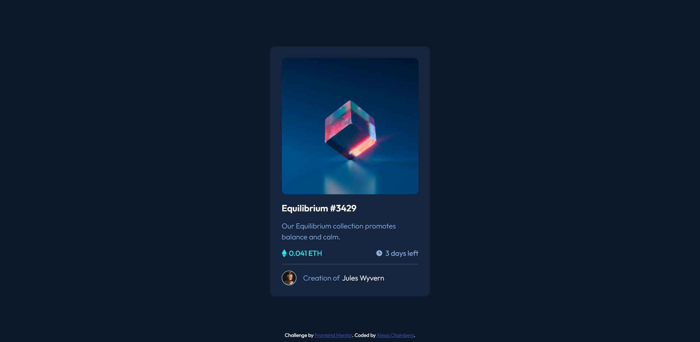
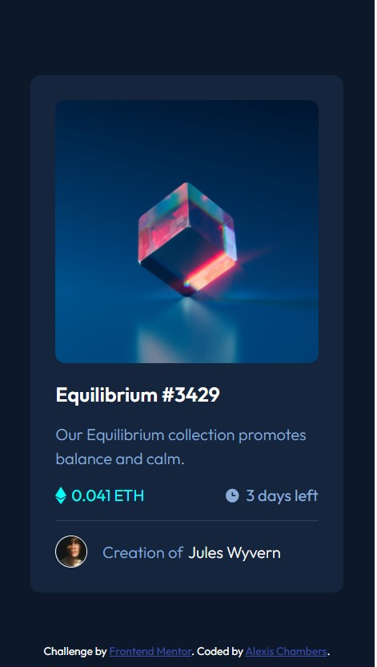

# Frontend Mentor - NFT preview card component solution

This is a solution to the [NFT preview card component challenge on Frontend Mentor](https://www.frontendmentor.io/challenges/nft-preview-card-component-SbdUL_w0U). Frontend Mentor challenges help you improve your coding skills by building realistic projects. 

## Table of contents

- [Overview](#overview)
  - [The challenge](#the-challenge)
  - [Screenshot](#screenshot)
  - [Links](#links)
- [My process](#my-process)
  - [Built with](#built-with)
  - [What I learned](#what-i-learned)
- [Author](#author)

## Overview

### The challenge

Users should be able to:

- View the optimal layout depending on their device's screen size
- See hover states for interactive elements

### Screenshot

### Links

- Solution URL: [Add solution URL here](https://github.com/kowai-onigiri/NFT-Preview-Card)
- Live Site URL: [Add live site URL here](https://kowai-onigiri.github.io/NFT-Preview-Card/)

## My process

### Built with

- Semantic HTML5 markup
- CSS custom properties
- Flexbox
- Mobile-first workflow
- DOM manipulation

### What I learned

- practice with Flexbox
- practice with responsive web design and mobile-first workflow
-practice with DOM manipulation

## Author

- Frontend Mentor - [@kowai-onigiri](https://www.frontendmentor.io/profile/kowai-onigri)

